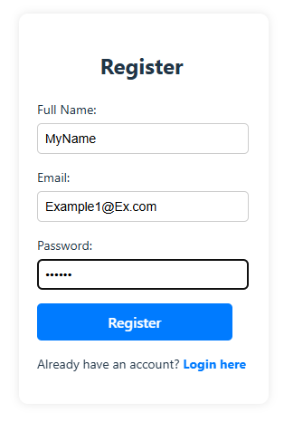
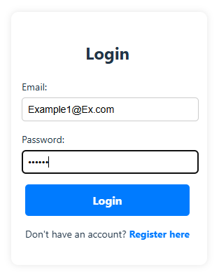
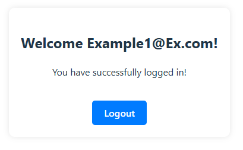

# User Management - Frontend

## Overview  
This repository contains the frontend for the User Management system, built with **React + TypeScript** using **Vite** for fast development and optimized performance. The frontend interacts with the backend API to provide a user-friendly authentication experience.

### User Interface  
The application provides the following key views:

#### Registration Page

Users can create a new account by providing their full name, email, and password.

#### Login Page

Registered users can log in using their email and password.

#### Welcome Page

After logging in, users see a personalized welcome message and can log out.

## Technologies Used  
- **React** with TypeScript
- **Vite** for fast builds and performance optimization
- **React Router** for navigation
- **Tailwind CSS** for styling
- **Axios** for API requests

## Project Structure  
```
user-management-client/
│── public/              # Static assets
│── src/                 # Source code
│   │── components/      # Reusable UI components
│   │── pages/           # Page-level components (Login, Register, Dashboard)
│   │── api/             # API calls to backend
│   │── hooks/           # Custom React hooks
│   │── App.tsx          # Main app component
│   │── main.tsx         # Application entry point
│── assets/              # Images used in documentation
│── package.json         # Project dependencies
│── vite.config.ts       # Vite configuration
│── tsconfig.json        # TypeScript configuration
```

## Installation & Setup  

### 1. Clone the repository  
```sh
git clone https://github.com/davidNidam1/user-management-client.git
cd user-management-client
```

### 2. Install dependencies  
Ensure you have **Node.js 18+** installed. If not, download it from:
https://nodejs.org/

Then, install dependencies:
```sh
npm install
```

### 3. Configure Backend API URL  
By default, the frontend communicates with `http://localhost:5089`. If your backend runs on a different address, update the API base URL inside the `src/api/config.ts` file:
```ts
export const API_BASE_URL = "http://your-backend-url";
```

### 4. Run the frontend  
Start the development server with:
```sh
npm run dev
```
The application will be available at:
```
http://localhost:5173
```

## Features & User Flow  
- **Registration:** Users can register with an email and password.
- **Login:** Users authenticate using their credentials.
- **Protected Routes:** Only logged-in users can access certain pages.
- **Logout:** Users can securely log out.

## Future Improvements  
If more time were available, the following improvements could be implemented:
- **More advanced UI/UX design** with animations and better styling.
- **Better error handling and validation** for user input.
- **Token refresh mechanism** for better authentication security.
- **Deployment to a cloud provider** (e.g., Vercel, Netlify).

